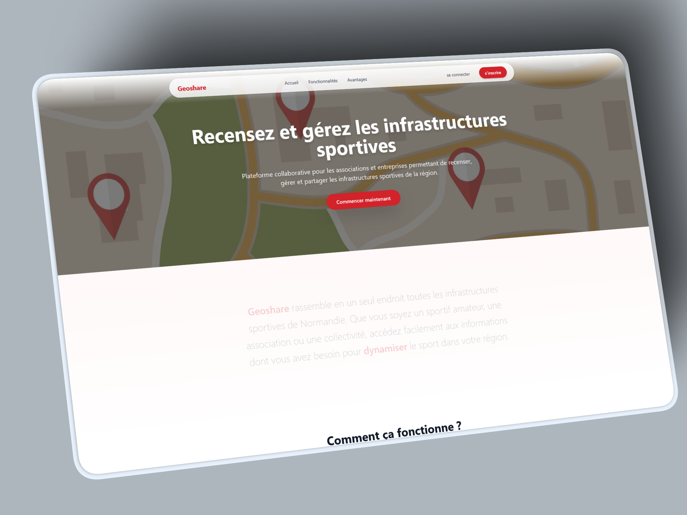
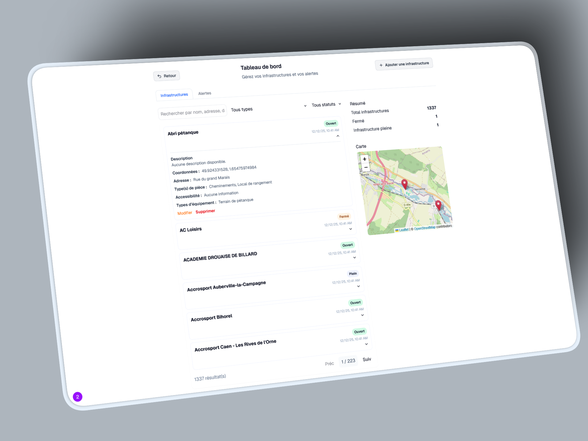
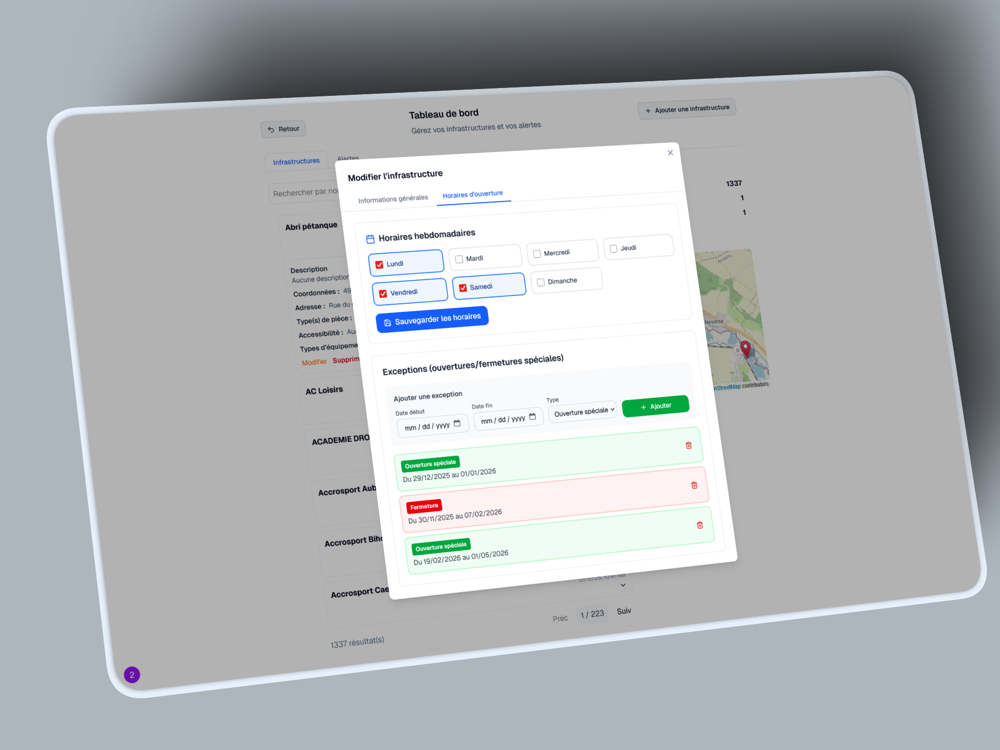
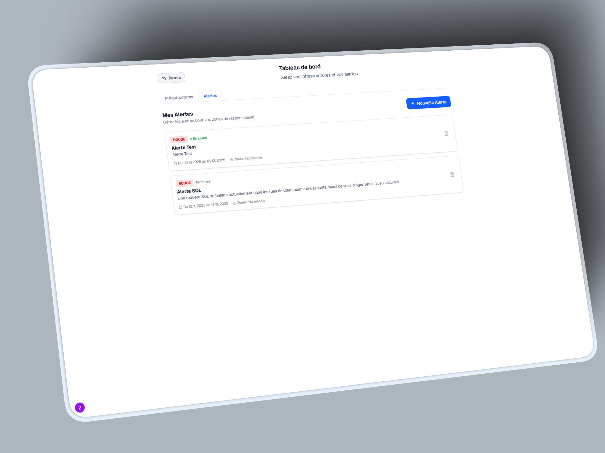

# Geoshare

Geoshare est une application web moderne de partage et de visualisation cartographique. Elle permet aux utilisateurs d'avoir des informations sur les infrastructures qui les entourent.

## Images 







## 🚀 Fonctionnalités

*   **Authentification & Utilisateurs** : Système complet d'inscription et de connexion sécurisé.
*   **Tableau de bord (Dashboard)** : Interface utilisateur pour la gestion des données des infrastructures et des paramètres application.
*   **Carte Interactive** : Visualisation de données géographiques avec Leaflet.
*   **Alertes** : Alertes automatiques en fonction de danger autour de soit avec les zones d'abris les plus proches automatiquement affichées.
*   **Infrastructures** : Visualisation de plein d'informations sur les infrastructures (Jour d'ouverture, Accessibilité, Utilité, Image, Itinéraire, ...)
*   **Recherches** : Recherches sur les infrastructures avec des filtres approfondies (Type, Accessibilité, Utilité, ...)
*   **Interface Moderne** : UI responsive et élégante construite avec les derniers standards web.

## 🛠️ Technologies Utilisées

Ce projet utilise une stack technique moderne et performante :

*   **Framework Frontend** : [Next.js 16](https://nextjs.org/) (App Router)
*   **Langage** : [TypeScript](https://www.typescriptlang.org/)
*   **Styling** : [Tailwind CSS 4](https://tailwindcss.com/)
*   **Base de Données** : MySQL (avec `mysql2`)
*   **Carte** : [Leaflet](https://leafletjs.com/) & [React Leaflet](https://react-leaflet.js.org/)
*   **Validation** : Zod & React Hook Form
*   **Composants UI** : Radix UI & Shadcn icons

## 📦 Installation

Suivez ces étapes pour installer et lancer le projet localement.

### Prérequis

*   [Node.js](https://nodejs.org/) (version compatible avec Next.js 16)
*   [MySQL](https://www.mysql.com/)

### 1. Cloner le projet

```bash
git clone https://github.com/votre-user/Geoshare-R310.git
cd Geoshare-R310
```

### 2. Installer les dépendances

```bash
npm install
```

### 3. Configuration de l'environnement

Créez un fichier `.env` à la racine du projet en vous basant sur le fichier `.env.example` :

```bash
cp .env.example .env
```

Modifiez ensuite le fichier `.env` avec vos informations de connexion à la base de données :

```env
MYSQL_HOST=localhost
MYSQL_USER=votre_utilisateur
MYSQL_PASSWORD=votre_mot_de_passe
MYSQL_DATABASE=votre_db_name
```

### 4. Base de données

Importez le schéma de la base de données pour initialiser les tables nécessaires. Utilisez le fichier `schema.sql` situé à la racine du projet.

```bash
mysql -u votre_utilisateur -p votre_db_name < schema.sql
```

### 5. Lancer le projet en développement

```bash
npm run dev
```

L'application sera accessible sur `http://localhost:3000`.

## 🏗️ Build et Production

Pour construire l'application pour la production :

```bash
npm run build
```

Puis pour lancer le serveur de production :

```bash
npm run start
```

## 👥 Contributeurs

*   [Infuseting](https://github.com/Infuseting)
*   [Antoin9-e](https://github.com/Antoin9-e)
*   [remynder0](https://github.com/remynder0)
